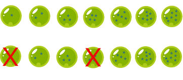

## Desafio

Kogu está buscando as esferas do dragão para invocar Xenlongão e pedir para ele reviver seu amigo Kuriri, que infelizmente morreu de novo na última batalha dos guerreiros Zê.
Porém Kogu está tendo muita dificuldade para encontrar as esferas, por isso Xenlongão que é seu conhecido há muito tempo, decidiu abrir uma exceção e aceitou ser invocado caso Kogu encontre todas as esferas cujo o número de divisores da quantidade de estrelas da esfera sejam par.
Por exemplo se existem sete esferas, Kogu não precisaria encontrar as esferas de uma e quatro estrelas, pois elas tem uma quantidade ímpar de divisores, então ele só precisa pegar 5 esferas para invocar Xenlongão.

<p align="center">
    
</p>

Como Kogu não é muito bom em contas, ele pediu para você escrever um programa que dado o total de esferas existentes, mostre a quantidade mínima de esferas que ele precisa procurar.

## Entrada

A primeira linha consiste de um inteiro C que representa a quantidade de casos de teste. As linhas subsequentes contém um inteiro N (2 ≤ N ≤ 109) que representa a quantidade de esferas necessárias para invocar Xenlongão.

## Saída

Seu programa deve exibir a quantidade mínima de esferas que Kogu tem que procurar.

| Exemplo de Entrada | Exemplo de Saída|
| ---|--- |
| 1<br />7 | 5 |

The First Contest 2017 - IFSULDEMINAS

```bash
....

```
 


