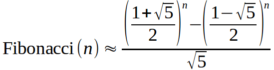

## Desafio

A fórmula de Binet é uma forma de calcular números de Fibonacci.

<p align="center">
    
</p>

Sua tarefa é, dado um natural n, calcular o valor de Fibonacci(n) usando a fórmula acima.

## Entrada

A entrada é um número natural n (0 < n ≤ 50).

## Saída

A saída é o valor de Fibonacci(n) com 1 casa decimal utilizando a fórmula de Binet dada.

| Exemplo de Entrada | Exemplo de Saída|
| ---|--- |
| 1 | 1.0 |
| 2 | 1.0 |
| 3 | 2.0 |

```bash
import java.util.Locale;
import java.util.Scanner;

public class Main {

	public static void main(String[] args) {
		Scanner sc = new Scanner(System.in);
	
     //escreva o seu código aqui

	}
}


```