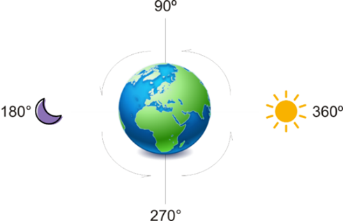

## Desafio

<p align="center">
    
</p>

Novamente Júlio pede sua ajuda, ele esqueceu de um pequeno detalhe. Como o seu o programa anterior só informava uma saudação, ele pediu que transformasse o grau do Sol/Lua em HH:MM:SS. Então caso aceite: dado um grau relativo a posição do Sol/Lua, refaça o sistema só que agora além da saudação de cada período do dia, informe exatamente as horas, os minutos e segundos.


## Entrada

A entrada contem um pontos flutuantes M (0 ≥ M < 360) representando a posição, em graus,do Sol/Lua em relação a terra. Como eles andam em constante movimento seu programa receberá diversos casos a cada segundo(EOF).

## Saída

Imprima qual período do dia ele se encontra: "Boa Tarde!!", "Boa Noite!!", "Bom Dia!!" e "De Madrugada!!", e na linhas de baixo exiba as horas, minutos e segundos (HH:MM:SS).

| Exemplo de Entrada | Exemplo de Saída|
| ---|--- |
| 1.50<br />95.5<br />187.5<br />279.5 | Bom Dia!!<br />06:06:00<br />Boa Tarde!!<br />12:22:00<br />Boa Noite!!<br />18:30:00<br />De Madrugada!!<br />00:38:00 |

```bash
import java.io.IOException;
import java.util.Scanner;

public class Teste{
	
    public static void main(String[] args) throws IOException {
    	Scanner leitor = new Scanner(System.in);
    	while (leitor.hasNext()) {
    		double graus = leitor.nextDouble();
    		
    		if (graus <= 360) {
	    		if (graus < 90 || graus == 360) System.out.println("Bom Dia!!");
	    		else if (        ) System.out.println("Boa Tarde!!");
	    		else if (        ) System.out.println("Boa Noite!!");
	    		else if (        ) System.out.println("De Madrugada!!");
	    		else System.out.println("Bom Dia!!");
	    		    
	    		Double horas;
	    		if (graus >= 270) {
	    			horas =             ;
	    		} else {                                   //Complete o código nos espaços em branco
	    			horas =             ;
	    		}
	    		
	    		Double minutos = (             ) % 60.0;
	    		Double segundos = (          ) % 60.0;
	    		
	    		if (segundos > 59) {
	    			segundos = 0.0;
	    			minutos += 1.0;
	    		}
	    		
	    		System.out.printf("%02d:%02d:%02d%n", horas.intValue(), minutos.intValue(), segundos.intValue());
    		}
    	}
    }
    
}

```