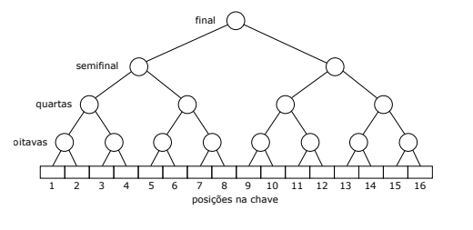

## Desafio

O sorteio das posições dos jogadores na chave decisiva da copa do mundo de ping-pong está deixando a todos nervosos. É que ninguém quer pegar o jogador mais bem ranqueado, o Mestre Kung, logo nas oitavas de final, ou nas quartas de final. Melhor que só seja possível enfrentar Mestre Kung na semifinal ou na final!
A chave possui 16 posições numeradas de 1 a 16, como na figura abaixo. A organização da copa vai fazer um sorteio para definir em qual posição cada jogador vai iniciar a chave decisiva. Nas oitavas de final, o jogador na posição 1 enfrenta o jogador na posição 2; o da posição 3 enfrenta o da posição 4; e assim por diante, como na figura.

<p align="center">
	
</p>

O objetivo deste problema é, dadas as posições de Mestre Kung e Mestre Lu na chave, decidir em que fase da competição Mestre Kung e Mestre Lu vão se enfrentar, caso vençam todas as suas respectivas partidas antes de se enfrentarem. Por exemplo, se o sorteio da chave determinar que Mestre Kung ocupará a posição 1 e Mestre Lu a posição 2 da chave, eles se encontrarão nas oitavas de final; se Mestre Kung ocupar a posição 6 e Mestre Kung ocupar a posição 9 da chave, eles se encontrarão somente na final.

## Entrada

A entrada consiste de duas linhas. A primeira linha da entrada contém um inteiro K (1 ≤ K ≤ 16) que indica a posição de Mestre Kung na chave. A segunda linha da entrada contém um inteiro L (1 ≤ L ≤ 16, K \(\ne \) L) que indica a posição de Mestre Lu na chave.

## Saída

Seu programa deve produzir uma linha contendo uma das palavras seguintes, decidindo a fase em que vão se enfrentar os jogadores Mestre Kung e Mestre Lu, se eles chegarem a se enfrentar: oitavas, quartas, semifinal ou final.

| Exemplo de Entrada | Exemplo de Saída|
| ---|--- |
| 10<br />14 | semifinal |
| 7<br />8 | oitavas |
| 3<br />13 | final |
| 5<br />8 | quartas |

```bash
import java.io.IOException;
import java.util.Scanner;

public class Main {

    public static void main(String[] args) throws IOException {
        Scanner leitor = new Scanner(System.in);
        
        //escreva o seu código aqui
       
    }

}

```