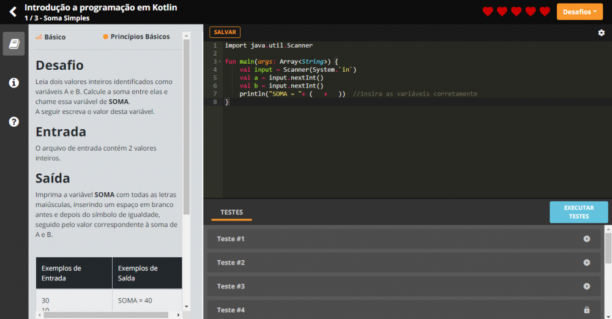
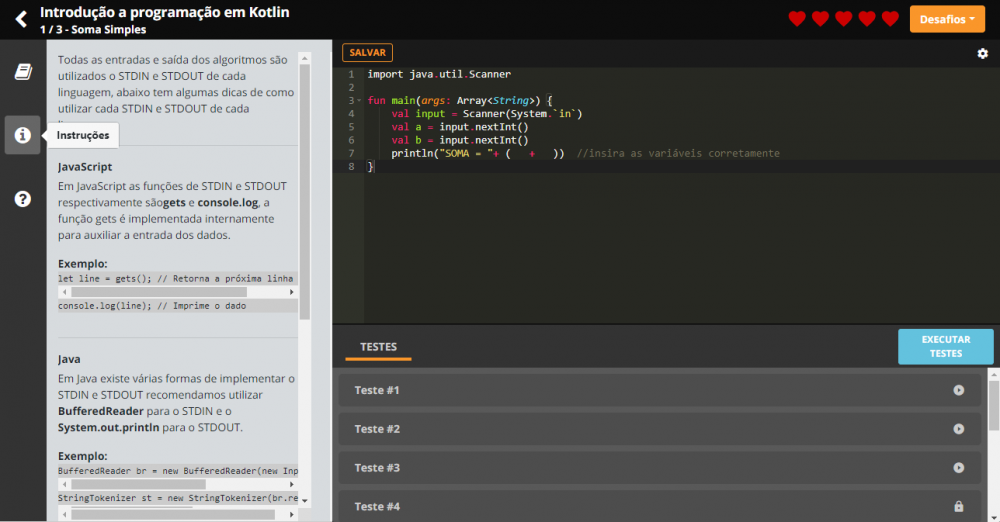
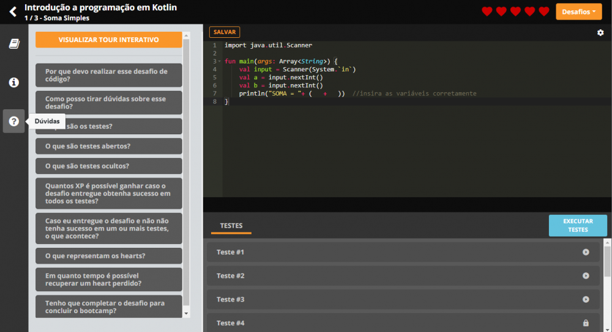
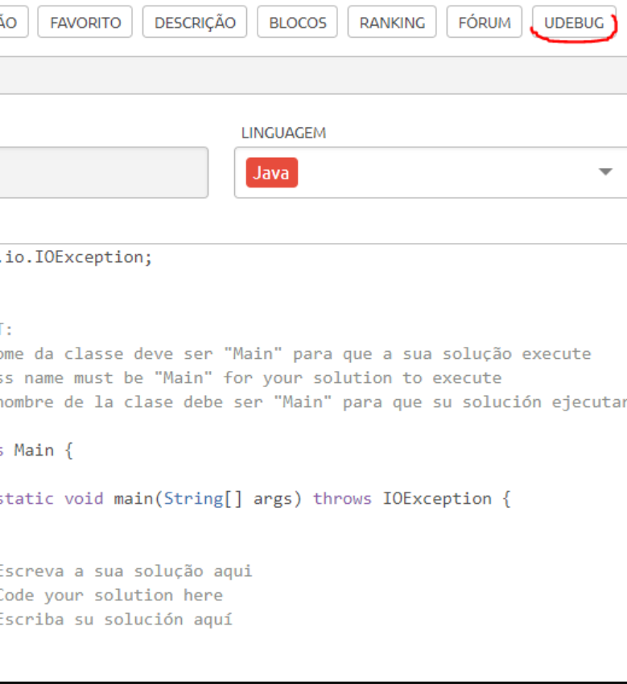
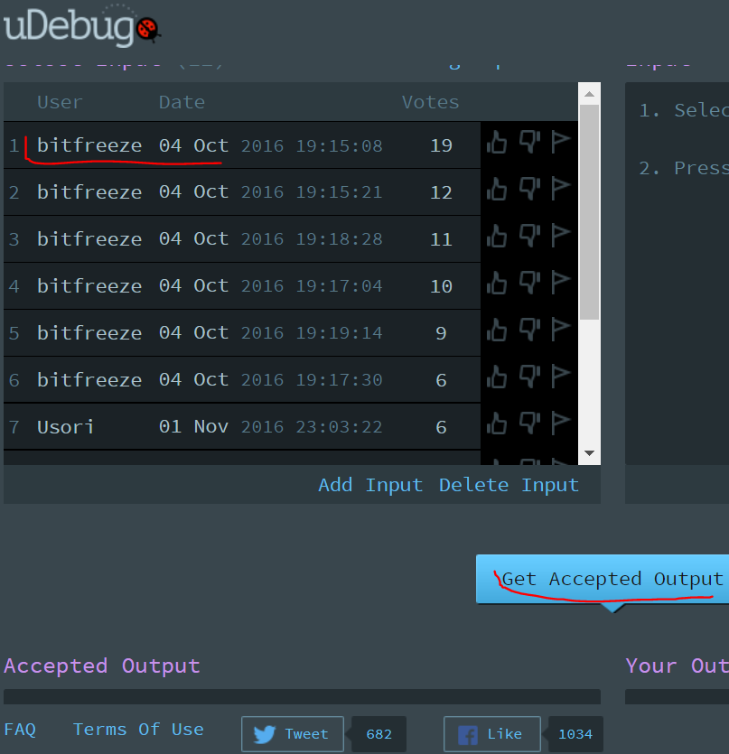
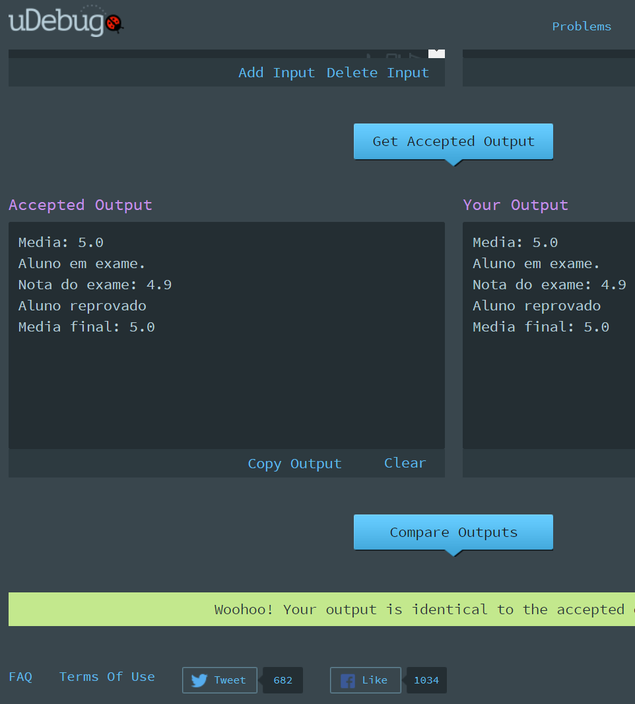

<h1 align="center">Desafios e Soluções dos Bootcamps da Digital Innovation One :books:</h1>

<!--Banner session-->
<p align="center">
  
</p>

<p align="center">
  <!-- C# -->
  <a href="https://github.com/shyoutarou/desafios-DIO/tree/master/Desafios/C%20Sharp">
    
  </a>
  <!-- Java -->
  <a href="https://github.com/shyoutarou/desafios-DIO/tree/master/Desafios/Java">
    
  </a>
  <!-- JavaScript -->
  <a href="https://github.com/shyoutarou/desafios-DIO/tree/master/Desafios/JavaScript">
    
  </a>
  <!-- Kotlin -->
  <a href="https://github.com/shyoutarou/desafios-DIO/tree/master/Desafios/Kotlin">
    
  </a>
  <!-- Python -->
  <a href="https://github.com/shyoutarou/desafios-DIO/tree/master/Desafios/Python">
    
  </a>
  <!-- Ruby -->
  <a href="https://github.com/shyoutarou/desafios-DIO/tree/master/Desafios/Ruby">
    
  </a>
</p><br>

Clique no logotipo da linguagem para conferir soluções que ainda não estão listadas abaixo:

<!-- C Sharp -->
<details>
    <summary><strong>C Sharp</strong></summary>
    <br />
    <div align="left">
	    <!-- Desafios Aritméticos em C# -->
        <table border=1>
            <tr>
                <th colspan="4">Desafios Aritméticos em C#</th>
            </tr>
            <tr>
                <th colspan="4"></th>
            </tr>
            <tr>
                <th>Etapa</th>
                <th>Desafio</th>
                <th>Solução</th>
                <th>Status</th>
            </tr>
            <tr>
                <td align="center">1</td>
                <td>Bazinga!</td>
                <td><a href="https://github.com/shyoutarou/desafios-DIO/blob/master/Desafios/C%20Sharp/Desafios%20Aritm%C3%A9ticos%20em%20C%23/Bazinga!/solucao.cs">Código</a></td>
                <td align="center">✔️</td>
            </tr>
            <tr>
                <td align="center">2</td>
                <td>Comunicação em Piralândia</td>
                <td><a href="https://github.com/shyoutarou/desafios-DIO/blob/master/Desafios/C%20Sharp/Desafios%20Aritm%C3%A9ticos%20em%20C%23/Comunica%C3%A7%C3%A3o%20em%20Piral%C3%A2ndia/solucao.cs">Código</a></td>
                <td align="center">✔️</td>
            </tr>
            <tr>
                <td align="center">3</td>
                <td>Crescimento Populacional</td>
                <td><a href="https://github.com/shyoutarou/desafios-DIO/blob/master/Desafios/C%20Sharp/Desafios%20Aritm%C3%A9ticos%20em%20C%23/Crescimento%20Populacional/solucao.cs">Código</a></td>
                <td align="center">✔️</td>
			<tr>
            <tr>
                <td align="center">3</td>
                <td>Média 1</td>
                <td><a href="https://github.com/shyoutarou/desafios-DIO/blob/master/Desafios/C%20Sharp/Desafios%20Aritm%C3%A9ticos%20em%20C%23/M%C3%A9dia%201/solucao.cs">Código</a></td>
                <td align="center">✔️</td>
			<tr>
            <tr>
                <td align="center">3</td>
                <td>Tempo de um Evento</td>
                <td><a href="https://github.com/shyoutarou/desafios-DIO/blob/master/Desafios/C%20Sharp/Desafios%20Aritm%C3%A9ticos%20em%20C%23/Tempo%20de%20um%20Evento/solucao.cs">Código</a></td>
                <td align="center">✔️</td>
			<tr>			
        </table>
        <!-- Introdução a Programação com C# -->
        <table border=1>
            <tr>
                <th colspan="4">Introdução a Programação com C#</th>
            </tr>
            <tr>
                <th colspan="4"></th>
            </tr>
            <tr>
                <th>Etapa</th>
                <th>Desafio</th>
                <th>Solução</th>
                <th>Status</th>
            </tr>
            <tr>
                <td align="center">1</td>
                <td>Dividindo X por Y</td>
                <td><a href="https://github.com/shyoutarou/desafios-DIO/tree/master/Desafios/C%20Sharp/Introdu%C3%A7%C3%A3o%20a%20Programa%C3%A7%C3%A3o%20com%20C%23/Dividindo%20X%20por%20Y/solucao.cs">Código</a></td>
                <td align="center">✔️</td>
            </tr>
            <tr>
                <td align="center">2</td>
                <td>Distância</td>
                <td><a href="https://github.com/shyoutarou/desafios-DIO/tree/master/Desafios/C%20Sharp/Introdu%C3%A7%C3%A3o%20a%20Programa%C3%A7%C3%A3o%20com%20C%23/Dist%C3%A2ncia/solucao.cs">Código</a></td>
                <td align="center">✔️</td>
            </tr>
            <tr>
                <td align="center">3</td>
                <td>Quanta Mandioca?</td>
                <td><a href="https://github.com/shyoutarou/desafios-DIO/tree/master/Desafios/C%20Sharp/Introdu%C3%A7%C3%A3o%20a%20Programa%C3%A7%C3%A3o%20com%20C%23/Quanta%20Mandioca/solucao.cs">Código</a></td>
                <td align="center">✔️</td>
        </table>
        <!-- Introdução a Programação com .NET -->
        <table border=1>
            <tr>
                <th colspan="4">Introdução a Programação com .NET</th>
            </tr>
            <tr>
                <th colspan="4"></th>
            </tr>
            <tr>
                <th>Etapa</th>
                <th>Desafio</th>
                <th>Solução</th>
                <th>Status</th>
            </tr>
            <tr>
                <td align="center">1</td>
                <td>Dividindo X por Y</td>
                <td><a href="https://github.com/shyoutarou/desafios-DIO/blob/master/Desafios/C%20Sharp/Introdu%C3%A7%C3%A3o%20a%20Programa%C3%A7%C3%A3o%20com%20.NET/Dividindo%20X%20por%20Y/solucao.cs">Código</a></td>
                <td align="center">✔️</td>
            </tr>
            <tr>
                <td align="center">2</td>
                <td>Bazinga!</td>
                <td><a href="https://github.com/shyoutarou/desafios-DIO/blob/master/Desafios/C%20Sharp/Introdu%C3%A7%C3%A3o%20a%20Programa%C3%A7%C3%A3o%20com%20.NET/Bazinga!/solucao.cs">Código</a></td>
                <td align="center">✔️</td>
            </tr>
            <tr>
                <td align="center">3</td>
                <td>Coxinha de Bueno</td>
                <td><a href="https://github.com/shyoutarou/desafios-DIO/blob/master/Desafios/C%20Sharp/Introdu%C3%A7%C3%A3o%20a%20Programa%C3%A7%C3%A3o%20com%20.NET/Coxinha%20de%20Bueno/solucao.cs">Código</a></td>
                <td align="center">✔️</td>
        </table>
        <!-- Desenvolvendo Algoritmos com C# -->
        <table border=1>
            <tr>
                <th colspan="4">Desenvolvendo Algoritmos com C#</th>
            </tr>
            <tr>
                <th colspan="4"></th>
            </tr>
            <tr>
                <th>Etapa</th>
                <th>Desafio</th>
                <th>Solução</th>
                <th>Status</th>
            </tr>
            <tr>
                <td align="center">1</td>
                <td>Cálculo de Viagem</td>
                <td><a href="https://github.com/shyoutarou/desafios-DIO/tree/master/Desafios/C%20Sharp/4.%20Desenvolvendo%20algoritmos%20com%20C%23/C%C3%A1lculo%20de%20Viagem/solucao.cs">Código</a></td>
                <td align="center">✔️</td>
            </tr>
            <tr>
                <td align="center">2</td>
                <td>Álbum da Copa</td>
                <td><a href="https://github.com/shyoutarou/desafios-DIO/tree/master/Desafios/C%20Sharp/4.%20Desenvolvendo%20algoritmos%20com%20C%23/%C3%81lbum%20da%20Copa/solucao.cs">Código</a></td>
                <td align="center">✔️</td>
            </tr>
            <tr>
                <td align="center">3</td>
                <td>Animal</td>
                <td><a href="https://github.com/shyoutarou/desafios-DIO/tree/master/Desafios/C%20Sharp/4.%20Desenvolvendo%20algoritmos%20com%20C%23/Animal/solucao.cs">Código</a></td>
                <td align="center">✔️</td>
            </tr>
        </table>
        <!-- Desafios Aritméticos em C# -->
        <table border=1>
            <tr>
                <th colspan="4">Desafios Aritméticos em C#</th>
            </tr>
            <tr>
                <th colspan="4"></th>
            </tr>
            <tr>
                <th>Etapa</th>
                <th>Desafio</th>
                <th>Solução</th>
                <th>Status</th>
            </tr>
            <tr>
                <td align="center">1</td>
                <td>Média 1</td>
                <td><a href="https://github.com/shyoutarou/desafios-DIO/tree/master/Desafios/C%20Sharp/6.%20Desafios%20Aritm%C3%A9ticos%20em%20C%23/M%C3%A9dia%201/solucao.cs">Código</a></td>
                <td align="center">✔️</td>
            </tr>
            <tr>
                <td align="center">2</td>
                <td>Crescimento Populacional</td>
                <td><a href="https://github.com/shyoutarou/desafios-DIO/tree/master/Desafios/C%20Sharp/6.%20Desafios%20Aritm%C3%A9ticos%20em%20C%23/Crescimento%20Populacional/solucao.cs">Código</a></td>
                <td align="center">✔️</td>
            </tr>
            <tr>
                <td align="center">3</td>
                <td>Bazinga!</td>
                <td><a href="https://github.com/shyoutarou/desafios-DIO/tree/master/Desafios/C%20Sharp/6.%20Desafios%20Aritm%C3%A9ticos%20em%20C%23/Bazinga!/solucao.cs">Código</a></td>
                <td align="center">✔️</td>
            </tr>
            <tr>
                <td align="center">4</td>
                <td>Tempo de um Evento</td>
                <td><a href="https://github.com/shyoutarou/desafios-DIO/tree/master/Desafios/C%20Sharp/6.%20Desafios%20Aritm%C3%A9ticos%20em%20C%23/4.%20Tempo%20de%20um%20Evento/solucao.cs">Código</a></td>
                <td align="center">✔️</td>
            </tr>
            <tr>
                <td align="center">5</td>
                <td>Comunicação em Piralândia</td>
                <td><a href="https://github.com/shyoutarou/desafios-DIO/tree/master/Desafios/C%20Sharp/6.%20Desafios%20Aritm%C3%A9ticos%20em%20C%23/5.%20Comunica%C3%A7%C3%A3o%20em%20Piral%C3%A2ndia/solucao.cs">Código</a></td>
                <td align="center">✔️</td>
            </tr>
        </table>
        <!-- Resolvendo Algoritmos -->
        <table border=1>
            <tr>
                <th colspan="4">Resolvendo Algoritmos</th>
            </tr>
            <tr>
                <th colspan="4"></th>
            </tr>
            <tr>
                <th>Etapa</th>
                <th>Desafio</th>
                <th>Solução</th>
                <th>Status</th>
            </tr>
            <tr>
                <td align="center">1</td>
                <td>Hora da Corrida</td>
                <td><a href="https://github.com/shyoutarou/desafios-DIO/tree/master/Desafios/C%20Sharp/Resolvendo%20Algoritmos/Hora%20da%20Corrida/solucao.cs">Código</a></td>
                <td align="center">✔️</td>
            </tr>
            <tr>
                <td align="center">2</td>
                <td>Cardápio Aéreo</td>
                <td><a href="https://github.com/shyoutarou/desafios-DIO/tree/master/Desafios/C%20Sharp/Resolvendo%20Algoritmos/Card%C3%A1pio%20A%C3%A9reo/solucao.cs">Código</a></td>
                <td align="center">✔️</td>
            </tr>
            <tr>
                <td align="center">3</td>
                <td>Pizza Antes do Final do Ano</td>
                <td><a href="https://github.com/shyoutarou/desafios-DIO/tree/master/Desafios/C%20Sharp/Resolvendo%20Algoritmos/Pizza%20Antes%20do%20Final%20do%20Ano/solucao.cs">Código</a></td>
                <td align="center">✔️</td>
            </tr>
            <tr>
                <td align="center">4</td>
                <td>Conversão de Tempo</td>
                <td><a href="https://github.com/shyoutarou/desafios-DIO/tree/master/Desafios/C%20Sharp/Resolvendo%20Algoritmos/4.%20Convers%C3%A3o%20de%20Tempo/solucao.cs">Código</a></td>
                <td align="center">✔️</td>
            </tr>
            <tr>
                <td align="center">5</td>
                <td>Idade em Dias</td>
                <td><a href="https://github.com/shyoutarou/desafios-DIO/tree/master/Desafios/C%20Sharp/Resolvendo%20Algoritmos/5.%20Idade%20em%20Dias/solucao.cs">Código</a></td>
                <td align="center">✔️</td>
            </tr>
            <tr>
                <td align="center">6</td>
                <td>Tempo do Dobby</td>
                <td><a href="https://github.com/shyoutarou/desafios-DIO/tree/master/Desafios/C%20Sharp/Resolvendo%20Algoritmos/6.%20Tempo%20do%20Dobby/solucao.cs">Código</a></td>
                <td align="center">✔️</td>
            </tr>
            <tr>
                <td align="center">7</td>
                <td>Rodízio de Cavalos e Carruagens</td>
                <td><a href="https://github.com/shyoutarou/desafios-DIO/tree/master/Desafios/C%20Sharp/Resolvendo%20Algoritmos/7.%20Rod%C3%ADzio%20de%20Cavalos%20e%20Carruagens/solucao.cs">Código</a></td>
                <td align="center">✔️</td>
            </tr>
        </table>
        <!-- Solução de Problemas em C# -->
        <table border=1>
            <tr>
                <th colspan="4">Solução de Problemas em C#</th>
            </tr>
            <tr>
                <th colspan="4"></th>
            </tr>
            <tr>
                <th>Etapa</th>
                <th>Desafio</th>
                <th>Solução</th>
                <th>Status</th>
            </tr>
            <tr>
                <td align="center">1</td>
                <td>Consumo Médio do Automóvel</td>
                <td><a href="https://github.com/shyoutarou/desafios-DIO/tree/master/Desafios/C%20Sharp/5.%20Solu%C3%A7%C3%A3o%20de%20Problemas%20em%20C%23/Consumo%20M%C3%A9dio%20do%20Autom%C3%B3vel/solucao.cs">Código</a></td>
                <td align="center">✔️</td>
            </tr>
            <tr>
                <td align="center">2</td>
                <td>DDD</td>
                <td><a href="https://github.com/shyoutarou/desafios-DIO/tree/master/Desafios/C%20Sharp/5.%20Solu%C3%A7%C3%A3o%20de%20Problemas%20em%20C%23/DDD/solucao.cs">Código</a></td>
                <td align="center">✔️</td>
            </tr>
            <tr>
                <td align="center">3</td>
                <td>Aumento de Salário</td>
                <td><a href="https://github.com/shyoutarou/desafios-DIO/tree/master/Desafios/C%20Sharp/5.%20Solu%C3%A7%C3%A3o%20de%20Problemas%20em%20C%23/Aumento%20de%20Sal%C3%A1rio/solucao.cs">Código</a></td>
                <td align="center">✔️</td>
            </tr>
        </table>
        <!-- Solução de Problemas Essencias com C# -->
        <table border=1>
            <tr>
                <th colspan="4">Solução de Problemas Essencias com C#</th>
            </tr>
            <tr>
                <th colspan="4"></th>
            </tr>
            <tr>
                <th>Etapa</th>
                <th>Desafio</th>
                <th>Solução</th>
                <th>Status</th>
            </tr>
            <tr>
                <td align="center">1</td>
                <td>Quadrado e ao Cubo</td>
                <td><a href="https://github.com/shyoutarou/desafios-DIO/tree/master/Desafios/C%20Sharp/Solu%C3%A7%C3%A3o%20de%20Problemas%20Essenciais%20com%20C%23/Quadrado%20e%20ao%20Cubo/solucao.cs">Código</a></td>
                <td align="center">✔️</td>
            </tr>
            <tr>
                <td align="center">2</td>
                <td>A Corrida de Tartarugas</td>
                <td><a href="https://github.com/shyoutarou/desafios-DIO/tree/master/Desafios/C%20Sharp/Solu%C3%A7%C3%A3o%20de%20Problemas%20Essenciais%20com%20C%23/A%20Corrida%20de%20Tartarugas/solucao.cs">Código</a></td>
                <td align="center">✔️</td>
            </tr>
            <tr>
                <td align="center">3</td>
                <td>Ultrapassando V</td>
                <td><a href="https://github.com/shyoutarou/desafios-DIO/tree/master/Desafios/C%20Sharp/Solu%C3%A7%C3%A3o%20de%20Problemas%20Essenciais%20com%20C%23/Ultrapassando%20V/solucao.cs">Código</a></td>
                <td align="center">✔️</td>
            </tr>
            <tr>
                <td align="center">4</td>
                <td>Validação de Nota</td>
                <td><a href="https://github.com/shyoutarou/desafios-DIO/tree/master/Desafios/C%20Sharp/Solu%C3%A7%C3%A3o%20de%20Problemas%20Essenciais%20com%20C%23/4.%20Valida%C3%A7%C3%A3o%20de%20Nota/solucao.cs">Código</a></td>
                <td align="center">✔️</td>
            </tr>
            <tr>
                <td align="center">5</td>
                <td>Pedro Bento e o Mundo de OZ</td>
                <td><a href="https://github.com/shyoutarou/desafios-DIO/tree/master/Desafios/C%20Sharp/Solu%C3%A7%C3%A3o%20de%20Problemas%20Essenciais%20com%20C%23/5.%20Pedro%20Bento%20e%20o%20Mundo%20de%20OZ/solucao.cs">Código</a></td>
                <td align="center">✔️</td>
            </tr>
        </table>
        <!-- Praticando Programação em C# -->
        <table border=1>
            <tr>
                <th colspan="4">Praticando Programação em C#</th>
            </tr>
            <tr>
                <th colspan="4"></th>
            </tr>
            <tr>
                <th>Etapa</th>
                <th>Desafio</th>
                <th>Solução</th>
                <th>Status</th>
            </tr>
            <tr>
                <td align="center">1</td>
                <td><a href="https://github.com/shyoutarou/desafios-DIO/tree/master/Desafios/C%20Sharp/8.%20Praticando%20Programa%C3%A7%C3%A3o%20em%20C%23/Coordenadas%20de%20um%20Ponto/README.md">Coordenadas de um Ponto</a></td>
                <td><a href="https://github.com/shyoutarou/desafios-DIO/tree/master/Desafios/C%20Sharp/8.%20Praticando%20Programa%C3%A7%C3%A3o%20em%20C%23/Coordenadas%20de%20um%20Ponto/solucao.cs">Código</a></td>
                <td align="center">✔️</td>
            </tr>
            <tr>
                <td align="center">2</td>
                <td><a href="https://github.com/shyoutarou/desafios-DIO/tree/master/Desafios/C%20Sharp/8.%20Praticando%20Programa%C3%A7%C3%A3o%20em%20C%23/Compras%20no%20Supermercado/README.md">Compras no Supermercado</a></td>
                <td><a href="https://github.com/shyoutarou/desafios-DIO/tree/master/Desafios/C%20Sharp/8.%20Praticando%20Programa%C3%A7%C3%A3o%20em%20C%23/Compras%20no%20Supermercado/solucao.cs">Código</a></td>
                <td align="center">✔️</td>
            </tr>
            <tr>
                <td align="center">3</td>
                <td><a href="https://github.com/shyoutarou/desafios-DIO/tree/master/Desafios/C%20Sharp/8.%20Praticando%20Programa%C3%A7%C3%A3o%20em%20C%23/Pink%20e%20C%C3%A9rebro/README.md">Pink e Cérebro</a></td>
                <td><a href="https://github.com/shyoutarou/desafios-DIO/tree/master/Desafios/C%20Sharp/8.%20Praticando%20Programa%C3%A7%C3%A3o%20em%20C%23/Pink%20e%20C%C3%A9rebro/solucao.cs">Código</a></td>
                <td align="center">✔️</td>
            </tr>
        </table>
        <!-- Praticando Programação em C# -->
    </div>
</details>

<!-- Java -->
<details>
    <summary><strong>Java</strong></summary>
    <br />
    <div align="left">
        <!-- Ordenação e Filtros em Java -->
        <table border=1>
            <tr>
                <th colspan="4">Ordenação e Filtros em Java</th>
            </tr>
            <tr>
                <th colspan="4"></th>
            </tr>
            <tr>
                <th>Etapa</th>
                <th>Desafio</th>
                <th>Solução</th>
                <th>Status</th>
            </tr>
            <tr>
                <td align="center">1</td>
                <td>Ordenando Números Pares e Ímpares</td>
                <td><a href="https://github.com/shyoutarou/desafios-DIO/tree/master/Desafios/Java/Ordena%C3%A7%C3%A3o%20e%20Filtros%20em%20Java/Ordenando%20N%C3%BAmeros%20Pares%20e%20%C3%8Dmpares/OrderingEvenNumbers.java">Código</a></td>
                <td align="center">✔️</td>
            </tr>
            <tr>
                <td align="center">2</td>
                <td>Compras no Supermercado</td>
                <td><a href="https://github.com/shyoutarou/desafios-DIO/tree/master/Desafios/Java/Ordena%C3%A7%C3%A3o%20e%20Filtros%20em%20Java/Compras%20no%20Supermercado/SupermarketShopping.java">Código</a></td>
                <td align="center">✔️</td>
            </tr>
            <tr>
                <td align="center">3</td>
                <td>Uniformes de Final de Ano</td>
                <td><a href="https://github.com/shyoutarou/desafios-DIO/tree/master/Desafios/Java/Ordena%C3%A7%C3%A3o%20e%20Filtros%20em%20Java/Uniformes%20de%20Final%20de%20Ano/YearEndUniform.java">Código</a></td>
                <td align="center">✔️</td>
            </tr>
            <tr>
                <td align="center">4</td>
                <td>Fila do Banco</td>
                <td><a href="https://github.com/shyoutarou/desafios-DIO/tree/master/Desafios/Java/Ordena%C3%A7%C3%A3o%20e%20Filtros%20em%20Java/4.%20Fila%20do%20Banco/BankQueue.java">Código</a></td>
                <td align="center">✔️</td>
            </tr>
            <tr>
                <td align="center">5</td>
                <td>Gincana no Acampamento</td>
                <td><a href="https://github.com/shyoutarou/desafios-DIO/tree/master/Desafios/Java/Ordena%C3%A7%C3%A3o%20e%20Filtros%20em%20Java/5.%20Gincana%20no%20Acampamento/GymkhanaInTheCamp.java">Código</a></td>
                <td align="center">✔️</td>
            </tr>
        </table>
        <!-- Resolvendo Algoritmos com Java -->
        <table border=1>
            <tr>
                <th colspan="4">Resolvendo Algoritmos com Java</th>
            </tr>
            <tr>
                <th colspan="4"></th>
            </tr>
            <tr>
                <th>Etapa</th>
                <th>Desafio</th>
                <th>Solução</th>
                <th>Status</th>
            </tr>
            <tr>
                <td align="center">1</td>
                <td>Coração das Cartas</td>
                <td><a href="https://github.com/shyoutarou/desafios-DIO/tree/master/Desafios/Java/Resolvendo%20Algoritmos%20com%20Java/Cora%C3%A7%C3%A3o%20das%20Cartas/Main.java">Código</a></td>
                <td align="center">✔️</td>
            </tr>
            <tr>
                <td align="center">2</td>
                <td>Abreviando Posts do Blog</td>
                <td><a href="https://github.com/shyoutarou/desafios-DIO/tree/master/Desafios/Java/Resolvendo%20Algoritmos%20com%20Java/Abreviando%20Posts%20do%20Blog/Main.java">Código</a></td>
                <td align="center">✔️</td>
            </tr>
            <tr>
                <td align="center">3</td>
                <td>Combinação de Strings</td>
                <td><a href="https://github.com/shyoutarou/desafios-DIO/tree/master/Desafios/Java/Resolvendo%20Algoritmos%20com%20Java/Combina%C3%A7%C3%A3o%20de%20Strings/Main.java">Código</a></td>
                <td align="center">✔️</td>
            </tr>
            <tr>
                <td align="center">4</td>
                <td>Hash Mágico</td>
                <td><a href="https://github.com/shyoutarou/desafios-DIO/tree/master/Desafios/Java/Resolvendo%20Algoritmos%20com%20Java/4.%20Hash%20M%C3%A1gico/Main.java">Código</a></td>
                <td align="center">✔️</td>
            </tr>
            <tr>
                <td align="center">5</td>
                <td>O Tabuleiro Secreto</td>
                <td><a href="https://github.com/shyoutarou/desafios-DIO/tree/master/Desafios/Java/Resolvendo%20Algoritmos%20com%20Java/5.%20O%20Tabuleiro%20Secreto/Main.java">Código</a></td>
                <td align="center">✔️</td>
            </tr>
        </table>
        <!-- Solução de Problemas Básicos em Java -->
        <table border=1>
            <tr>
                <th colspan="4">Solução de Problemas Básicos em Java</th>
            </tr>
            <tr>
                <th colspan="4"></th>
            </tr>
            <tr>
                <th>Etapa</th>
                <th>Desafio</th>
                <th>Solução</th>
                <th>Status</th>
            </tr>
            <tr>
                <td align="center">1</td>
                <td>Exibindo Números Pares</td>
                <td><a href="https://github.com/shyoutarou/desafios-DIO/tree/master/Desafios/Java/Solu%C3%A7%C3%A3o%20de%20Problemas%20B%C3%A1sicos%20em%20Java/Exibindo%20N%C3%BAmeros%20Pares/solucao.java">Código</a></td>
                <td align="center">✔️</td>
            </tr>
            <tr>
                <td align="center">2</td>
                <td>Idade em Dias</td>
                <td><a href="https://github.com/shyoutarou/desafios-DIO/tree/master/Desafios/Java/Solu%C3%A7%C3%A3o%20de%20Problemas%20B%C3%A1sicos%20em%20Java/Idade%20em%20Dias/solucao.java">Código</a></td>
                <td align="center">✔️</td>
            </tr>
            <tr>
                <td align="center">3</td>
                <td>Notas da Prova</td>
                <td><a href="https://github.com/shyoutarou/desafios-DIO/tree/master/Desafios/Java/Solu%C3%A7%C3%A3o%20de%20Problemas%20B%C3%A1sicos%20em%20Java/Notas%20da%20Prova/solucao.java">Código</a></td>
                <td align="center">✔️</td>
            </tr>
        </table>
    </div>
</details>

<!-- JavaScript -->
<details> 
    <summary><strong>JavaScript</strong></summary>
    <br />
    <div align="left">
        <!-- Introdução a Programação -->
        <table border=1>
            <tr>
                <th colspan="4">Introdução a Programação</th>
            </tr>
            <tr>
                <th colspan="4"></th>
            </tr>
            <tr>
                <th>Etapa</th>
                <th>Desafio</th>
                <th>Solução</th>
                <th>Status</th>
            </tr>
            <tr>
                <td align="center">1</td>
                <td>Dividindo X por Y</td>
                <td><a href="https://github.com/shyoutarou/desafios-DIO/tree/master/Desafios/JavaScript/Introdu%C3%A7%C3%A3o%20a%20Programa%C3%A7%C3%A3o/1.Dvividindo%20X%20por%20Y/solucao.js">Código</a></td>
                <td align="center">✔️</td>
            </tr>
            <tr>
                <td align="center">2</td>
                <td>Distância</td>
                <td><a href="https://github.com/shyoutarou/desafios-DIO/tree/master/Desafios/JavaScript/Introdu%C3%A7%C3%A3o%20a%20Programa%C3%A7%C3%A3o/1.Dist%C3%A2ncia/solucao.js">Código</a></td>
                <td align="center">✔️</td>
            </tr>
            <tr>
                <td align="center">3</td>
                <td>Quanta Mandioca?</td>
                <td><a href="https://github.com/shyoutarou/desafios-DIO/tree/master/Desafios/JavaScript/Introdu%C3%A7%C3%A3o%20a%20Programa%C3%A7%C3%A3o/1.Quanta%20Mandioca/solucao.js">Código</a></td>
                <td align="center">✔️</td>
            </tr>
        </table>
        <!-- Introdução a Programação com JavaScript -->
        <table border=1>
            <tr>
                <th colspan="4">Introdução a Programação com JavaScript</th>
            </tr>
            <tr>
                <th colspan="4"></th>
            </tr>
            <tr>
                <th>Etapa</th>
                <th>Desafio</th>
                <th>Solução</th>
                <th>Status</th>
            </tr>
            <tr>
                <td align="center">1</td>
                <td>Visita na Feira</td>
                <td><a href="https://github.com/shyoutarou/desafios-DIO/tree/master/Desafios/JavaScript/7.%20Introdu%C3%A7%C3%A3o%20a%20Programa%C3%A7%C3%A3o%20com%20JavaScript/Visita%20na%20Feira/solucao.js">Código</a></td>
                <td align="center">✔️</td>
            </tr>
            <tr>
                <td align="center">2</td>
                <td>Multiplicação Simples</td>
                <td><a href="https://github.com/shyoutarou/desafios-DIO/tree/master/Desafios/JavaScript/7.%20Introdu%C3%A7%C3%A3o%20a%20Programa%C3%A7%C3%A3o%20com%20JavaScript/Multiplica%C3%A7%C3%A3o%20Simples/solucao.js">Código</a></td>
                <td align="center">✔️</td>
            </tr>
            <tr>
                <td align="center">3</td>
                <td>Folha de Pagamento</td>
                <td><a href="https://github.com/shyoutarou/desafios-DIO/tree/master/Desafios/JavaScript/7.%20Introdu%C3%A7%C3%A3o%20a%20Programa%C3%A7%C3%A3o%20com%20JavaScript/Folha%20de%20Pagamento/solucao.js">Código</a></td>
                <td align="center">✔️</td>
            </tr>
        </table>
        <!-- Fundamentos Aritméticos -->
        <table border=1>
            <tr>
                <th colspan="4">Fundamentos Aritméticos</th>
            </tr>
            <tr>
                <th colspan="4"></th>
            </tr>
            <tr>
                <th>Etapa</th>
                <th>Desafio</th>
                <th>Solução</th>
                <th>Status</th>
            </tr>
            <tr>
                <td align="center">1</td>
                <td>Quantidade de Números Positivos</td>
                <td><a href="https://github.com/shyoutarou/desafios-DIO/tree/master/Desafios/JavaScript/Fundamentos%20Aritm%C3%A9ticos/2.Quantidade%20de%20N%C3%BAmeros%20Positivos/solucao.js">Código</a></td>
                <td align="center">✔️</td>
            </tr>
            <tr>
                <td align="center">2</td>
                <td>Exibindo Números Pares</td>
                <td><a href="https://github.com/shyoutarou/desafios-DIO/tree/master/Desafios/JavaScript/Fundamentos%20Aritm%C3%A9ticos/2.Exibindo%20N%C3%BAmeros%20Pares/solucao.js">Código</a></td>
                <td align="center">✔️</td>
            </tr>
            <tr>
                <td align="center">3</td>
                <td>Análise de Números</td>
                <td><a href="https://github.com/shyoutarou/desafios-DIO/tree/master/Desafios/JavaScript/Fundamentos%20Aritm%C3%A9ticos/2.An%C3%A1lise%20de%20N%C3%BAmeros/solucao.js">Código</a></td>
                <td align="center">✔️</td>
            </tr>
            <tr>
                <td align="center">4</td>
                <td>Contagem de Cédulas</td>
                <td><a href="https://github.com/shyoutarou/desafios-DIO/tree/master/Desafios/JavaScript/Fundamentos%20Aritm%C3%A9ticos/2.4.%20Contagem%20de%20C%C3%A9dulas/solucao.js">Código</a></td>
                <td align="center">✔️</td>
            </tr>
            <tr>
                <td align="center">5</td>
                <td>Consumo Médio do Automóvel</td>
                <td><a href="https://github.com/shyoutarou/desafios-DIO/tree/master/Desafios/JavaScript/Fundamentos%20Aritm%C3%A9ticos/2.5.%20Consumo%20M%C3%A9dio%20do%20Autom%C3%B3vel/solucao.js">Código</a></td>
                <td align="center">✔️</td>
            </tr>
        </table>
        <!-- Problemas Aritméticos -->
        <table border=1>
            <tr>
                <th colspan="4">Problemas Aritméticos</th>
            </tr>
            <tr>
                <th colspan="4"></th>
            </tr>
            <tr>
                <th>Etapa</th>
                <th>Desafio</th>
                <th>Solução</th>
                <th>Status</th>
            </tr>
            <tr>
                <td align="center">1</td>
                <td>Soma Simples</td>
                <td><a href="https://github.com/shyoutarou/desafios-DIO/tree/master/Desafios/JavaScript/Problemas%20Aritm%C3%A9ticos/3.Soma%20Simples/solucao.js">Código</a></td>
                <td align="center">✔️</td>
            </tr>
            <tr>
                <td align="center">2</td>
                <td>Coxinha de Bueno</td>
                <td><a href="https://github.com/shyoutarou/desafios-DIO/tree/master/Desafios/JavaScript/Problemas%20Aritm%C3%A9ticos/3.Coxinha%20de%20Bueno/solucao.js">Código</a></td>
                <td align="center">✔️</td>
            </tr>
            <tr>
                <td align="center">3</td>
                <td>Cálculo da Viagem</td>
                <td><a href="https://github.com/shyoutarou/desafios-DIO/tree/master/Desafios/JavaScript/Problemas%20Aritm%C3%A9ticos/3.C%C3%A1lculo%20da%20Viagem/solucao.js">Código</a></td>
                <td align="center">✔️</td>
            </tr>
            <tr>
                <td align="center">4</td>
                <td>Imposto de Renda</td>
                <td><a href="https://github.com/shyoutarou/desafios-DIO/tree/master/Desafios/JavaScript/Problemas%20Aritm%C3%A9ticos/3.4.%20Imposto%20de%20Renda/solucao.js">Código</a></td>
                <td align="center">✔️</td>
            </tr>
            <tr>
                <td align="center">5</td>
                <td>Teorema da Divisão Euclidiana</td>
                <td><a href="https://github.com/shyoutarou/desafios-DIO/tree/master/Desafios/JavaScript/Problemas%20Aritm%C3%A9ticos/3.5.%20Teorema%20da%20Divis%C3%A3o%20Euclidiana/solucao.js">Código</a></td>
                <td align="center">✔️</td>
            </tr>
        </table>
        <!-- Solução de Problemas Básicos em JavaScript -->
        <table border=1>
            <tr>
                <th colspan="4">Solução de Problemas Básicos em JavaScript</th>
            </tr>
            <tr>
                <th colspan="4"></th>
            </tr>
            <tr>
                <th>Etapa</th>
                <th>Desafio</th>
                <th>Solução</th>
                <th>Status</th>
            </tr>
            <tr>
                <td align="center">1</td>
                <td>Dividindo X por Y</td>
                <td><a href="https://github.com/shyoutarou/desafios-DIO/tree/master/Desafios/JavaScript/8.%20%20Solu%C3%A7%C3%A3o%20de%20Problemas%20B%C3%A1sicos%20em%20JavaScript/Dividindo%20X%20por%20Y/solucao.js">Código</a></td>
                <td align="center">✔️</td>
            </tr>
            <tr>
                <td align="center">2</td>
                <td>Blobs</td>
                <td><a href="https://github.com/shyoutarou/desafios-DIO/tree/master/Desafios/JavaScript/8.%20%20Solu%C3%A7%C3%A3o%20de%20Problemas%20B%C3%A1sicos%20em%20JavaScript/Blobs/solucao.js">Código</a></td>
                <td align="center">✔️</td>
            </tr>
            <tr>
                <td align="center">3</td>
                <td>Tipos de Combustível</td>
                <td><a href="https://github.com/shyoutarou/desafios-DIO/tree/master/Desafios/JavaScript/8.%20%20Solu%C3%A7%C3%A3o%20de%20Problemas%20B%C3%A1sicos%20em%20JavaScript/Tipo%20de%20Combust%C3%ADvel/solucao.js">Código</a></td>
                <td align="center">✔️</td>
            </tr>
        </table>
        <!-- Soluções e Problemas Essenciais -->
        <table border=1>
            <tr>
                <th colspan="4">Soluções e Problemas Essenciais</th>
            </tr>
            <tr>
                <th colspan="4"></th>
            </tr>
            <tr>
                <th>Etapa</th>
                <th>Desafio</th>
                <th>Solução</th>
                <th>Status</th>
            </tr>
            <tr>
                <td align="center">1</td>
                <td>Quadrado e ao Cubo</td>
                <td><a href="https://github.com/shyoutarou/desafios-DIO/tree/master/Desafios/JavaScript/4.%20Solu%C3%A7%C3%A3o%20de%20Problemas%20Essenciais/4.Quadrado%20e%20ao%20Cubo/solucao.js">Código</a></td>
                <td align="center">✔️</td>
            </tr>
            <tr>
                <td align="center">2</td>
                <td>A Corrida de Tartarugas</td>
                <td><a href="https://github.com/shyoutarou/desafios-DIO/tree/master/Desafios/JavaScript/4.%20Solu%C3%A7%C3%A3o%20de%20Problemas%20Essenciais/4.A%20Corrida%20de%20Tartarugas/solucao.js">Código</a></td>
                <td align="center">✔️</td>
            </tr>
            <tr>
                <td align="center">3</td>
                <td>Ultrapassando V</td>
                <td><a href="https://github.com/shyoutarou/desafios-DIO/tree/master/Desafios/JavaScript/4.%20Solu%C3%A7%C3%A3o%20de%20Problemas%20Essenciais/4.Ultrapassando%20V/solucao.js">Código</a></td>
                <td align="center">✔️</td>
            </tr>
            <tr>
                <td align="center">4</td>
                <td>Validação da Nota</td>
                <td><a href="https://github.com/shyoutarou/desafios-DIO/tree/master/Desafios/JavaScript/4.%20Solu%C3%A7%C3%A3o%20de%20Problemas%20Essenciais/4.4.%20Valida%C3%A7%C3%A3o%20da%20Nota/solucao.js">Código</a></td>
                <td align="center">✔️</td>
            </tr>
            <tr>
                <td align="center">5</td>
                <td>Pedro Bento e o Mundo de OZ</td>
                <td><a href="https://github.com/shyoutarou/desafios-DIO/tree/master/Desafios/JavaScript/4.%20Solu%C3%A7%C3%A3o%20de%20Problemas%20Essenciais/4.5.%20Pedro%20Bento%20e%20o%20Mundo%20de%20OZ/solucao.js">Código</a></td>
                <td align="center">✔️</td>
            </tr>
        </table>
        <!-- Busca e Laços de Repetição -->
        <table border=1>
            <tr>
                <th colspan="4">Busca e Laços de Repetição</th>
            </tr>
            <tr>
                <th colspan="4"></th>
            </tr>
            <tr>
                <th>Etapa</th>
                <th>Desafio</th>
                <th>Solução</th>
                <th>Status</th>
            </tr>
            <tr>
                <td align="center">1</td>
                <td>O Escolhido</td>
                <td><a href="https://github.com/shyoutarou/desafios-DIO/tree/master/Desafios/JavaScript/5.%20Busca%20e%20La%C3%A7os%20de%20Repeti%C3%A7%C3%A3o/5.O%20Escolhido/solucao.js">Código</a></td>
                <td align="center">✔️</td>
            </tr>
            <tr>
                <td align="center">2</td>
                <td>Comunicação em Piralândia</td>
                <td><a href="https://github.com/shyoutarou/desafios-DIO/tree/master/Desafios/JavaScript/5.%20Busca%20e%20La%C3%A7os%20de%20Repeti%C3%A7%C3%A3o/5.Comunica%C3%A7%C3%A3o%20em%20Piral%C3%A2ndia/solucao.js">Código</a></td>
                <td align="center">✔️</td>
            </tr>
            <tr>
                <td align="center">3</td>
                <td>Degustação de Vinho</td>
                <td><a href="https://github.com/shyoutarou/desafios-DIO/tree/master/Desafios/JavaScript/5.%20Busca%20e%20La%C3%A7os%20de%20Repeti%C3%A7%C3%A3o/5.Degusta%C3%A7%C3%A3o%20de%20Vinho/solucao.js">Código</a></td>
                <td align="center">✔️</td>
            </tr>
            <tr>
                <td align="center">4</td>
                <td>Pink e Cérebro</td>
                <td><a href="https://github.com/shyoutarou/desafios-DIO/tree/master/Desafios/JavaScript/5.%20Busca%20e%20La%C3%A7os%20de%20Repeti%C3%A7%C3%A3o/5.4.%20Pink%20e%20C%C3%A9rebro/solution.js">Código</a></td>
                <td align="center">✔️</td>
            </tr>
            <tr>
                <td align="center">5</td>
                <td>Menor e Posição</td>
                <td><a href="https://github.com/shyoutarou/desafios-DIO/tree/master/Desafios/JavaScript/5.%20Busca%20e%20La%C3%A7os%20de%20Repeti%C3%A7%C3%A3o/5.5.%20Menor%20e%20Posi%C3%A7%C3%A3o/solution.js">Código</a></td>
                <td align="center">✔️</td>
            </tr>
        </table>
        <!-- Desenvolvimento de Problemas Avançados em JavaScript -->
        <table border=1>
            <tr>
                <th colspan="4">Desenvolvimento de Problemas Avançados em JavaScript</th>
            </tr>
            <tr>
                <th colspan="4"></th>
            </tr>
            <tr>
                <th>Etapa</th>
                <th>Desafio</th>
                <th>Solução</th>
                <th>Status</th>
            </tr>
            <tr>
                <td align="center">1</td>
                <td>Ordenando Números Pares e Ímpares</td>
                <td><a href="https://github.com/shyoutarou/desafios-DIO/tree/master/Desafios/JavaScript/6.%20Desenvolvimento%20de%20problemas%20avan%C3%A7ados%20em%20JavaScript/Ordenando%20N%C3%BAmeros%20Pares%20e%20%C3%8Dmpares/solucao.js">Código</a></td>
                <td align="center">✔️</td>
            </tr>
            <tr>
                <td align="center">2</td>
                <td>Animal</td>
                <td><a href="https://github.com/shyoutarou/desafios-DIO/tree/master/Desafios/JavaScript/6.%20Desenvolvimento%20de%20problemas%20avan%C3%A7ados%20em%20JavaScript/Animal/solucao.js">Código</a></td>
                <td align="center">✔️</td>
            </tr>
            <tr>
                <td align="center">3</td>
                <td>Compras no Supermercado</td>
                <td><a href="https://github.com/shyoutarou/desafios-DIO/tree/master/Desafios/JavaScript/6.%20Desenvolvimento%20de%20problemas%20avan%C3%A7ados%20em%20JavaScript/Compras%20no%20Supermercado/solucao.js">Código</a></td>
                <td align="center">✔️</td>
            </tr>
        </table>
    </div>
</details>

<!-- Kotlin -->
<details>
    <summary><strong>Kotlin</strong></summary>
    <br />
    <div align="left">
        <!-- Introdução a Programação em Kotlin -->
        <table border=1>
            <tr>
                <th colspan="4">Introdução a Programação em Kotlin</th>
            </tr>
            <tr>
                <th colspan="4"></th>
            </tr>
            <tr>
                <th>Etapa</th>
                <th>Desafio</th>
                <th>Solução</th>
                <th>Status</th>
            </tr>
            <tr>
                <td align="center">1</td>
                <td><a href="https://github.com/shyoutarou/desafios-DIO/tree/master/Desafios/Kotlin/Introdu%C3%A7%C3%A3o%20a%20programa%C3%A7%C3%A3o%20em%20Kotlin/Soma%20Simples/README.md">Soma Simples</a></td>
                <td><a href="https://github.com/shyoutarou/desafios-DIO/tree/master/Desafios/Kotlin/Introdu%C3%A7%C3%A3o%20a%20programa%C3%A7%C3%A3o%20em%20Kotlin/Soma%20Simples/solucao.kt">Código</a></td>
                <td align="center">✔️</td>
            </tr>
            <tr>
                <td align="center">2</td>
                <td><a href="https://github.com/shyoutarou/desafios-DIO/tree/master/Desafios/Kotlin/Introdu%C3%A7%C3%A3o%20a%20programa%C3%A7%C3%A3o%20em%20Kotlin/N%C3%BAmeros%20%C3%8Dmpares/README.md">Números Ímpares</a></td>
                <td><a href="https://github.com/shyoutarou/desafios-DIO/tree/master/Desafios/Kotlin/Introdu%C3%A7%C3%A3o%20a%20programa%C3%A7%C3%A3o%20em%20Kotlin/N%C3%BAmeros%20%C3%8Dmpares/solucao.kt">Código</a></td>
                <td align="center">✔️</td>
            </tr>
            <tr>
                <td align="center">3</td>
                <td><a href="https://github.com/shyoutarou/desafios-DIO/tree/master/Desafios/Kotlin/Introdu%C3%A7%C3%A3o%20a%20programa%C3%A7%C3%A3o%20em%20Kotlin/Quadrado%20e%20ao%20Cubo/README.md">Quadrado e ao Cubo</a></td>
                <td><a href="https://github.com/shyoutarou/desafios-DIO/tree/master/Desafios/Kotlin/Introdu%C3%A7%C3%A3o%20a%20programa%C3%A7%C3%A3o%20em%20Kotlin/Quadrado%20e%20ao%20Cubo/solucao.kt">Código</a></td>
                <td align="center">✔️</td>
        </table>
        <!-- Solucionando Problemas em Kotlin -->
        <table border=1>
            <tr>
                <th colspan="4">Solucionando Problemas em Kotlin</th>
            </tr>
            <tr>
                <th colspan="4"></th>
            </tr>
            <tr>
                <th>Etapa</th>
                <th>Desafio</th>
                <th>Solução</th>
                <th>Status</th>
            </tr>
            <tr>
                <td align="center">1</td>
                <td><a href="https://github.com/shyoutarou/desafios-DIO/tree/master/Desafios/Kotlin/Solucionando%20problemas%20em%20Kotlin/Taxa%20de%20Imposto%20de%20Renda/README.md">Taxa de Imposto de Renda</a></td>
                <td><a href="https://github.com/shyoutarou/desafios-DIO/tree/master/Desafios/Kotlin/Solucionando%20problemas%20em%20Kotlin/Taxa%20de%20Imposto%20de%20Renda/solucao.kt">Código</a></td>
                <td align="center">✔️</td>
            </tr>
            <tr>
                <td align="center">2</td>
                <td><a href="https://github.com/shyoutarou/desafios-DIO/tree/master/Desafios/Kotlin/Solucionando%20problemas%20em%20Kotlin/%C3%81rea%20do%20C%C3%ADrculo/README.md">Área do Círculo</a></td>
                <td><a href="https://github.com/shyoutarou/desafios-DIO/tree/master/Desafios/Kotlin/Solucionando%20problemas%20em%20Kotlin/%C3%81rea%20do%20C%C3%ADrculo/solucao.kt">Código</a></td>
                <td align="center">✔️</td>
            </tr>
            <tr>
                <td align="center">3</td>
                <td><a href="https://github.com/shyoutarou/desafios-DIO/tree/master/Desafios/Kotlin/Solucionando%20problemas%20em%20Kotlin/Primo%20R%C3%A1pido/README.md">Primo Rápido</a></td>
                <td><a href="https://github.com/shyoutarou/desafios-DIO/tree/master/Desafios/Kotlin/Solucionando%20problemas%20em%20Kotlin/Primo%20R%C3%A1pido/solucao.kt">Código</a></td>
                <td align="center">✔️</td>
            </tr>
            <tr>
                <td align="center">4</td>
                <td><a href="https://github.com/shyoutarou/desafios-DIO/tree/master/Desafios/Kotlin/Solucionando%20problemas%20em%20Kotlin/4.%20A%20Corrida%20de%20Tartarugas/README.md">A Corrida de Tartarugas</a></td>
                <td><a href="https://github.com/shyoutarou/desafios-DIO/tree/master/Desafios/Kotlin/Solucionando%20problemas%20em%20Kotlin/4.%20A%20Corrida%20de%20Tartarugas/solucao.kt">Código</a></td>
                <td align="center">✔️</td>
            </tr>
            <tr>
                <td align="center">5</td>
                <td><a href="https://github.com/shyoutarou/desafios-DIO/tree/master/Desafios/Kotlin/Solucionando%20problemas%20em%20Kotlin/5.%20Figurinhas/README.md">Figurinhas</a></td>
                <td><a href="https://github.com/shyoutarou/desafios-DIO/tree/master/Desafios/Kotlin/Solucionando%20problemas%20em%20Kotlin/5.%20Figurinhas/solucao.kt">Código</a></td>
                <td align="center">✔️</td>
            </tr>
        </table>
        <!-- Praticando Programação em Kotlin -->
        <table border=1>
            <tr>
                <th colspan="4">Praticando Programação em Kotlin</th>
            </tr>
            <tr>
                <th colspan="4"></th>
            </tr>
            <tr>
                <th>Etapa</th>
                <th>Desafio</th>
                <th>Solução</th>
                <th>Status</th>
            </tr>
            <tr>
                <td align="center">1</td>
                <td><a href="https://github.com/shyoutarou/desafios-DIO/tree/master/Desafios/Kotlin/Praticando%20programa%C3%A7%C3%A3o%20em%20Kotlin/O%20jogo%20Matem%C3%A1tico%20de%20Paula/README.md">O jogo Matemático de Paula</a></td>
                <td><a href="https://github.com/shyoutarou/desafios-DIO/tree/master/Desafios/Kotlin/Praticando%20programa%C3%A7%C3%A3o%20em%20Kotlin/O%20jogo%20Matem%C3%A1tico%20de%20Paula/solucao.kt">Código</a></td>
                <td align="center">✔️</td>
            </tr>
            <tr>
                <td align="center">2</td>
                <td><a href="https://github.com/shyoutarou/desafios-DIO/tree/master/Desafios/Kotlin/Praticando%20programa%C3%A7%C3%A3o%20em%20Kotlin/Convers%C3%A3o%20Simples%20de%20Base/README.md">Conversão Simples de Base</a></td>
                <td><a href="https://github.com/shyoutarou/desafios-DIO/tree/master/Desafios/Kotlin/Praticando%20programa%C3%A7%C3%A3o%20em%20Kotlin/Convers%C3%A3o%20Simples%20de%20Base/solucao.kt">Código</a></td>
                <td align="center">✔️</td>
            </tr>
            <tr>
                <td align="center">3</td>
                <td><a href="https://github.com/shyoutarou/desafios-DIO/tree/master/Desafios/Kotlin/Praticando%20programa%C3%A7%C3%A3o%20em%20Kotlin/Bob%20Conduite/README.md">Bob Conduite</a></td>
                <td><a href="https://github.com/shyoutarou/desafios-DIO/tree/master/Desafios/Kotlin/Praticando%20programa%C3%A7%C3%A3o%20em%20Kotlin/Bob%20Conduite/solucao.kt">Código</a></td>
                <td align="center">✔️</td>
            </tr>
        </table>
    </div>
</details>

<!-- Ruby -->
<details>
    <summary><strong>Ruby</strong></summary>
    <br />
    <div align="left">
        <!-- Solucionando Problemas Básicos em Ruby -->
        <table border=1>
            <tr>
                <th colspan="4">Solucionando Problemas Básicos em Ruby</th>
            </tr>
            <tr>
                <th colspan="4"></th>
            </tr>
            <tr>
                <th>Etapa</th>
                <th>Desafio</th>
                <th>Solução</th>
                <th>Status</th>
            </tr>
            <tr>
                <td align="center">1</td>
                <td>Par ou Ímpar</td>
                <td><a href="https://github.com/shyoutarou/desafios-DIO/tree/master/Desafios/Ruby/Solucionando%20Problemas%20B%C3%A1sicos%20em%20Ruby/Par%20ou%20%C3%8Dmpar/solucao.rb">Código</a></td>
                <td align="center">✔️</td>
            </tr>
            <tr>
                <td align="center">2</td>
                <td>DDD</td>
                <td><a href="https://github.com/shyoutarou/desafios-DIO/tree/master/Desafios/Ruby/Solucionando%20Problemas%20B%C3%A1sicos%20em%20Ruby/DDD/solucao.rb">Código</a></td>
                <td align="center">✔️</td>
            </tr>
            <tr>
                <td align="center">3</td>
                <td>Idade em Dias</td>
                <td><a href="https://github.com/shyoutarou/desafios-DIO/tree/master/Desafios/Ruby/Solucionando%20Problemas%20B%C3%A1sicos%20em%20Ruby/Idade%20em%20Dias/solucao.rb">Código</a></td>
                <td align="center">✔️</td>
        </table>
        <!-- Solucionando Problemas Básicos em Ruby -->
        <!-- Praticando com Desafios Intermediários em Ruby -->
        <table border=1>
            <tr>
                <th colspan="4">Praticando com Desafios Intermediários em Ruby</th>
            </tr>
            <tr>
                <th colspan="4"></th>
            </tr>
            <tr>
                <th>Etapa</th>
                <th>Desafio</th>
                <th>Solução</th>
                <th>Status</th>
            </tr>
            <tr>
                <td align="center">1</td>
                <td><a href="https://github.com/shyoutarou/desafios-DIO/tree/master/Desafios/Ruby/Praticando%20com%20Desafios%20Intermedi%C3%A1rios%20em%20Ruby/Encaixa%20ou%20N%C3%A3o/README.md">Encaixa ou Não?</a></td>
                <td><a href="https://github.com/shyoutarou/desafios-DIO/tree/master/Desafios/Ruby/Praticando%20com%20Desafios%20Intermedi%C3%A1rios%20em%20Ruby/Encaixa%20ou%20N%C3%A3o/solucao.rb">Código</a></td>
                <td align="center">✔️</td>
            </tr>
            <tr>
                <td align="center">2</td>
                <td><a href="https://github.com/shyoutarou/desafios-DIO/tree/master/Desafios/Ruby/Praticando%20com%20Desafios%20Intermedi%C3%A1rios%20em%20Ruby/Tipo%20de%20Combust%C3%ADvel/README.md">Tipo de Combustível</a></td>
                <td><a href="https://github.com/shyoutarou/desafios-DIO/tree/master/Desafios/Ruby/Praticando%20com%20Desafios%20Intermedi%C3%A1rios%20em%20Ruby/Tipo%20de%20Combust%C3%ADvel/solucao.rb">Código</a></td>
                <td align="center">✔️</td>
            </tr>
            <tr>
                <td align="center">3</td>
                <td><a href="https://github.com/shyoutarou/desafios-DIO/tree/master/Desafios/Ruby/Praticando%20com%20Desafios%20Intermedi%C3%A1rios%20em%20Ruby/Crescimento%20Populacional/README.md">Crescimento Populacional</a></td>
                <td><a href="https://github.com/shyoutarou/desafios-DIO/tree/master/Desafios/Ruby/Praticando%20com%20Desafios%20Intermedi%C3%A1rios%20em%20Ruby/Crescimento%20Populacional/solucao.rb">Código</a></td>
                <td align="center">✔️</td>
            </tr>
            <tr>
                <td align="center">4</td>
                <td><a href="https://github.com/shyoutarou/desafios-DIO/tree/master/Desafios/Ruby/Praticando%20com%20Desafios%20Intermedi%C3%A1rios%20em%20Ruby/4.%20Fibonacci%20F%C3%A1cil/README.md">Fibonacci Fácil</a></td>
                <td><a href="https://github.com/shyoutarou/desafios-DIO/tree/master/Desafios/Ruby/Praticando%20com%20Desafios%20Intermedi%C3%A1rios%20em%20Ruby/4.%20Fibonacci%20F%C3%A1cil/solucao.rb">Código</a></td>
                <td align="center">✔️</td>
            </tr>
            <tr>
                <td align="center">5</td>
                <td><a href="https://github.com/shyoutarou/desafios-DIO/tree/master/Desafios/Ruby/Praticando%20com%20Desafios%20Intermedi%C3%A1rios%20em%20Ruby/5.%20Sequ%C3%AAncia%20L%C3%B3gica/README.md">Sequência Lógica</a></td>
                <td><a href="https://github.com/shyoutarou/desafios-DIO/tree/master/Desafios/Ruby/Praticando%20com%20Desafios%20Intermedi%C3%A1rios%20em%20Ruby/5.%20Sequ%C3%AAncia%20L%C3%B3gica/solucao.rb">Código</a></td>
                <td align="center">✔️</td>
            </tr>
        </table>
        <!-- Praticando com Desafios Intermediários em Ruby -->
    </div>
</details>


## Resolvendo um desafio de código na prática

Para te auxiliar na conclusão do bootcamp, a equipe da DIO realizou uma live explicando o passo a passo sobre como resolver os desafios de código, confira:

[LIVE - Resolvendo um desafio de código na prática](https://www.youtube.com/watch?v=I8NI5QNUCe8)

Esses desafios lhe ajudarão a praticar e aplicar os conceitos apresentados nas aulas e exercícios. Para ter destaque na carreira de desenvolvimento de software é necessário praticar muito com algoritmos.

<p align="center">
  
</p>

O desafio lhe propõe praticar o pensamento computacional, exigindo a criação de uma solução implementada através do seu código com um conjunto de entradas e saídas esperadas.

Na área especificada acima, você deve digitar o seu código para a solução do desafio.

Clicando no botão "SALVAR", você pode ir salvando o seu código conforme for desenvolvendo.

No ícone de engrenagem, localizado no canto superior direito, você pode alterar as configurações do editor e deixar com a sua cara.

<p align="center">
  
</p>

Ao clicar em instruções, confira algumas intruções e dicas para implementação da sua solução.

Em "TESTES", ficarão todos os testes que serão executados junto a sua implementação da solução.

Os testes abertos (▶) podem ser executados a qualquer momento para você avaliar o código criado como solução para o desafio.
Os testes com cadeados (🔒) são ocultos e apenas serão executados quando você decidir entregar o seu código.

Através do botão "EXECUTAR TESTES", execute os testes abertos a qualquer momento para você avaliar o código criado como solução para o desafio.

<p align="center">
  
</p>

## [Discord](https://discord.com/invite/MUdRyVg)
 
Você também pode tirar dúvidas com milhares de Devs em nossa comunidade no Discord, acesse o link localizado no rodapé da página ou clique [aqui](https://discord.com/invite/MUdRyVg)

<p align="center">
  
</p>

Após revisado e testado o seu código, você deve clicar no botão "ENTREGAR DESAFIO", para avaliação em tempo real.

## Solução de Desafio Java, JavaScript e Kotlin

[Link para o artigo no GitHub](https://github.com/joseliojunior/library/tree/main/guia-de-bolso/desafios-da-dio)


## Entradas

Todos os desafios possuem maneiras diferentes de entrada de dados, ou seja, todos os valores que o desafio mostra em cada teste:
- Entram por alguma função (método) de entrada;
- Passam pelo nosso código;
- Saem por alguma função (método) de saída.

## Métodos de entrada

Dependendo da linguagem de programação que você esteja aprendendo o método de entrada é diferente. Aqui abaixo tem uma pequena lista com a linguagem e o método de entrada.


## JavaScript gets()
```bash
const entrada = gets();
```

Lembrando que gets( ) é uma função que funciona apenas na plataforma para a linguagem JavaScript.

## Java new Scanner(System.in)
```bash
import java.util.Scanner;


public class Main {
    public static void main(String[] args) {
        Scanner entrada = new Scanner(System.in);        
    }
}
```

## Kotlin readLine()
```bash
fun main() {
    val entrada = readLine()!! // Forma assertiva
}
fun main() {
    val entrada = readLine() ?: "" // Forma assegurada
}
```

## Exemplos de entrada
Supondo que tenhamos um arquivo de entrada:

```bash
abacaxi
banana
cereja
```

Onde precisamos pegar os valores de cada linha e guardar em uma variável, como faríamos?


## JavaScript
```bash
const entrada1 = gets(); // abacaxi
const entrada2 = gets(); // banana
const entrada3 = gets(); // cereja
```

## Java
```bash
import java.util.Scanner;

public class Main {
    public static void main(String[] args) {
        Scanner entrada = new Scanner(System.in);
        String entrada1 = entrada.nextLine(); // abacaxi
        String entrada2 = entrada.nextLine(); // banana
        String entrada3 = entrada.nextLine(); // cereja
        entrada.close();
    }
}
```

## Kotlin

```bash
fun main() {
    val entrada1 = readLine() ?: "" // abacaxi
    val entrada2 = readLine() ?: "" // banana
    val entrada3 = readLine() ?: "" // cereja
}

```

## Exemplo com o código de soma

A partir de agora vamos fazer um código de soma simples e entender alguns comportamentos de entrada e de saída.


## Entrada
```bash
15
20
7
```

## Algoritmo
```bash
INÍCIO DO PROCESSO
    > Armazenar a primeira entrada.
    > Não armazenar a segunda entrada.
    > Armazenar a terceira entrada.
    > Armazenar a soma da primeira com a terceira entrada.
    > Exibir o resultado do cálculo.
FIM DO PROCESSO
```

Para que possamos "pular" a segunda entrada basta executar a função de entrada sem nunca atribui-la a uma variável, dessa maneira a entrada é obtida, porém nunca armazenada.

## JavaScript
```bash
const entrada1 = Number(gets()); // 15
gets(); // "20"
const entrada3 = Number(gets()); // 7

const soma = entrada1 + entrada3;
console.log(soma); // 22
```


## Java
```bash
import java.util.Scanner;

public class Main {
    public static void main(String[] args) {
        Scanner entrada = new Scanner(System.in);
        int entrada1 = entrada.nextInt(); // 15
        entrada.nextInt(); // 20
        int entrada3 = entrada.nextInt(); // 7
        entrada.close();

        System.out.println(entrada1 + entrada3); // 22
    }
}

```

## Kotlin
```bash
fun main() {
    val entrada1 = readLine()?.toInt() ?: 0 // 15
    readLine() // "20"
    val entrada3 = readLine()?.toInt() ?: 0 // 7

    println(entrada1 + entrada2) // 22
}
```

Caso mudemos a entrada o nosso código deverá exibir a saída esperada para cada ocasião.


## Exemplos
Considerando o algoritmo acima que "pula" a segunda entrada temos:


## Teste 1

Entrada
```bash
10
20
30
```

Saída esperada
```bash
40
```

## Teste 2

Entrada
```bash
55
4890
15
```

Saída esperada
```bash
70
```

Logo o código feito para cada linguagem daria certo em ambos os testes, pois sempre entrariam a primeira e a terceira linha de entrada, faria-se a soma e seria por fim exibido o resultado que é igual a saída esperada por cada teste.


## Solução de Desafio C# 

[Link original](https://web.digitalinnovation.one/articles/entendendo-o-codigo-solucao-do-desafio-c-multiplos?back=%2Fhome&page=1&order=oldest)

Antes de iniciar qualquer desafio de código, é importante entender o que está sendo pedido e como a informação será processada pelo console.

Para exemplificar, vou usar o desafio Múltiplos.


```bash
using System;
class minhaClasse {
       static void Main(string[] args) {
           //continue a solucao com a insercao da variavel corretamente
           
       }
   }
```

O que esse bloco de código está me dizendo?

- Na linha 1, temos a diretiva using fazendo referência ao namespace System. Na prática isso significa que posso usar os tipos da System de forma não qualificada. Ou seja, posso chamar o Console diretamente, em vez de ter que chamar System.Console.
- Na linha 2, temos a classe que está sendo declarada.
- Na linha 3, temos o método Main, que é o único membro da classe minhaClasse. Ele também é o ponto de entrada desse programa e está recebendo um array de strings.


Agora vamos olhar a solução que precisa ser feita:

1. Instrução: Leia 2 valores inteiros (A e B). Após, o programa deve mostrar uma mensagem "São Multiplos" ou "Não são Multiplos", indicando se os valores lidos são múltiplos entre si.
2. Entrada: A entrada contém valores inteiros.
3. Saída: A saída deve conter uma das mensagens conforme descrito acima.


Vamos receber os dados:

```bash
using System;
class minhaClasse {
       static void Main(string[] args) {
           //continue a solucao com a insercao da variavel corretamente

           string[] valores = Console.ReadLine().Split(' ');
           int A = int.Parse(valores[0]);
           int B = int.Parse(valores[1]);
       }
    } 
```
         
- Na linha 6, temos o Console.ReadLine() lendo os dados e o Split(' ') separando esses dados por um espaço. Isso está sendo atribuído a variável valores que é um array.
- Na linha 7, estou selecionando o índice 0 do array. Dentro dele está o 1º item desse array, que é do tipo string. Para poder trabalhar com ele como se fosse um número, preciso convertê-lo. É isso que o int.Parse() está fazendo. Esse dado, já devidamente convertido, está sendo atribuído a variável A.
- Na linha 8, está acontecendo a mesma coisa. A diferença é que estou acessando o índice 1, que contém o 2º item do array.


Agora é preciso pensar no problema em si. Como que eu sei que 2 números são ou não são múltiplos um do outro? Como a tabuada é o exemplo clássico dos múltiplos, vamos olhar para ela:

- Tabuada de 2:
- 2x1 = 2 // 2x2 = 4 // 2x3 = 6 // 2x4 = 8 // 2x5 = 10
- Conjunto dos Múltiplos de 2 = {2, 4, 6, 8, 10, ...}


Então se observa que os múltiplos de um número são divisíveis por esse número, então o resto dessa divisão será 0.

- 2 / (qualquer múltiplo de 2) = (a um número natural) => Resto será 0
- 2 / 2 = 1 => resto 0
- 2 / 4 = 2 => resto 0
- 2 / 6 = 3 => resto 0


Vamos implementar isso:

```bash
using System;
class minhaClasse {
       static void Main(string[] args) {
           //continue a solucao com a insercao da variavel corretamente

           string[] valores = Console.ReadLine().Split(' ');
           int A = int.Parse(valores[0]);
           int B = int.Parse(valores[1]);

           if (A % B  == 0) {
               Console.WriteLine("Sao Multiplos");
           }
           else {
                Console.WriteLine("Nao sao Multiplos");
            }
        }
 }
```

- Na linha 10, ele vai dividir o valor A pelo valor B e se o resto for igual a 0, ele vai executar o que está dentro das { }
- Na linha 11, ele vai retornar a saída "Sao Multiplos", caso o if da linha 10 seja verdadeiro.
- Na linha 13, se o if da linha 10 for falso, ele vai executar o que está dentro das { } do else.
- Na linha 14, ele vai retornar a saída "Nao sao Multiplos", indicando que a verificação do if retornou falsa.


Esse código está bom, mas tem um problema. Ele só retorna verdadeiro quando A é múltiplo de B. Mas eu preciso que ele retorne verdadeiro também nos casos em que B é múltiplo de A.

- Porque? Porque a instrução pede que se verifique se os números recebidos são múltiplos entre si, em qualquer ordem.
- Sabemos que 2 e 4 são múltiplos entre si.
- Mas o meu código só vai retornar verdadeiro quando A = 4 e B = 2.
- Se eu receber esses números na ordem inversa, com A = 2 e B = 4 ele vai retornar falso.


Para resolver isso, vou adicionar o operador lógico ou (||) dentro do meu if.

```bash
using System;
class minhaClasse {
       static void Main(string[] args) {
           //continue a solucao com a insercao da variavel corretamente

           string[] valores = Console.ReadLine().Split(' ');
           int A = int.Parse(valores[0]);
           int B = int.Parse(valores[1]);

           if (A % B  == 0 || B % A == 0) {
               Console.WriteLine("Sao Multiplos");
           }
           else {
                Console.WriteLine("Nao sao Multiplos");
            }
        }
 }
```

Na linha 10, ele vai ver se o resto da divisão entre A e B é igual a 0 OU se o resto da divisão entre B e A é igual a 0. Se qualquer uma dessas condições for verdadeira, o if será verdadeiro e ele irá executar o que está dentro das { }

Pronto, agora o código vai passar em todos os testes de saída.

[Java para C#](https://kalkicode.com/ai/online-java-to-csharp-converter)
[Java para Kotlin ou Kotlin para Java](https://www.tutorialkart.com/kotlin/convert-java-file-to-kotlin-file/)

## uDebug do URI e testes fechados

[Link original](https://web.digitalinnovation.one/topics/utilizando-o-udebug-do-uri-para-resolver-desafios-da-dio?tab=forum&topic_type=all&back=%2Ftrack%2Fcarrefour-android-developer-1&back_order=newest&back_page=1&page=1&order=oldest)

 Os desafios de código da DIO vem do [URI online judge](www.urionlinejudge.com.br) e no URI tem uma seção de debug (exemplo: https://www.udebug.com/URI/1040), onde tem vários casos de teste que são por propostos por usuários para ajudar quem está fazendo um desafio a testar seu código. A DIO utiliza os testes do uDebug nos seus casos de teste, porém como os testes são criados por usuários eles podem estar errados, não são testes oficiais sugeridos pelo URI. No Debug do URI é possível ver se o resultado do código bate com os testes, independente do resultado dos testes do uDebug do URI fazerem sentido ou não, no fim o que importa é os seus resultados baterem.

Passo 1 - O primeiro passo é bem simples, que é achar o desafio da DIO no URI, para isso escreva no google mesmo urionlinejudge + (nome do desafio da DIO ou parte do enunciado do desafio).

Passo 2 - No URI vc vai no canto superior direito e clica em uDebug.

<p align="center">
  
</p>

Passo 3 - Na tela do uDebug você seleciona um caso de teste e clica em "Get Accepted Output".

<p align="center">
  
</p>

Passo 4 - Assim que vc clicar em "Get Accepted Output", a saida esperada do caso de teste vai aparecer abaixo, você copia a sua saida e cola ao lado em "your output" e clica em "Compare outputs".

<p align="center">
  
</p>

Obs: recomendo cuidado ao copiar a sua saida, copie tudo, inclusive quebra de linha que possa haver ao final dela. É melhor usar um ctrl+a ou qualquer outro comando seleção completa.

<p align="center">
  
</p>

Obs2: Não existe nenhuma trapaça em fazer isso, nem o URI e nem o uDebug vai te dar a solução dos desafios, você ainda terá que desenvolver o código. Essa é apenas uma ajuda para evitar dores de cabeça com casos de teste com erros.


## 🐛 Issues

Sinta-se à vontade para registrar um novo problema com o respectivo título e descrição no repositório do projeto. Se você já encontrou uma solução para seu problema, adoraria revisar sua solicitação de pull!

## 🤝 Contribuições

Siga os passos abaixo para contribuir:

1. Faça o *fork* do projeto (<https://github.com/shyoutarou/desafios-DIO.git>)

2. Clone o seu *fork* para sua maquína (`git clone https://github.com/user_name/desafios-DIO.git`)

3. Crie uma *branch* para realizar sua modificação (`git checkout -b feature/name_new_feature`)

4. Adicione suas modificações e faça o *commit* (`git commit -m "Descreva sua modificação"`)

5. *Push* (`git push origin feature/name_new_feature`)

6. Crie um novo *Pull Request*

7. Pronto, agora só aguardar a análise 🚀 

## 📜 License

O projeto lançado em 2021 sobre a licença [MIT](./LICENSE) ❤️ 

Made with ♥ by Shyoutarou

Gostou? Deixe uma estrelinha para ajudar o projeto ⭐